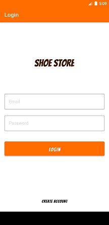
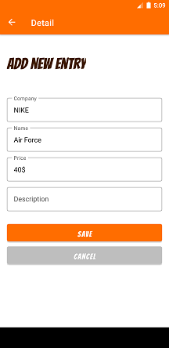

# Shoe Store Inventory

A shoe store inventory app to save shoes with their price, brand, size, and description.

### Screenshots

### Dependencies

     // KTX
    implementation 'androidx.core:core-ktx:1.3.1'

    // Navigation
    implementation "android.arch.navigation:navigation-fragment-ktx:1.0.0"
    implementation "android.arch.navigation:navigation-ui-ktx:1.0.0"

    // Lifecycles
    implementation 'androidx.lifecycle:lifecycle-extensions:2.2.0'

    //UI
    implementation "com.google.android.material:material:1.3.0-rc01"
    implementation "com.airbnb.android:lottie:$lottieVersion"

    implementation "androidx.activity:activity-ktx:$activity_version"
    implementation "androidx.fragment:fragment-ktx:$fragment_version"

## Built With

- Databinding 
- Navigation Controller 
- RecyclerView
- Single Activity architecture 